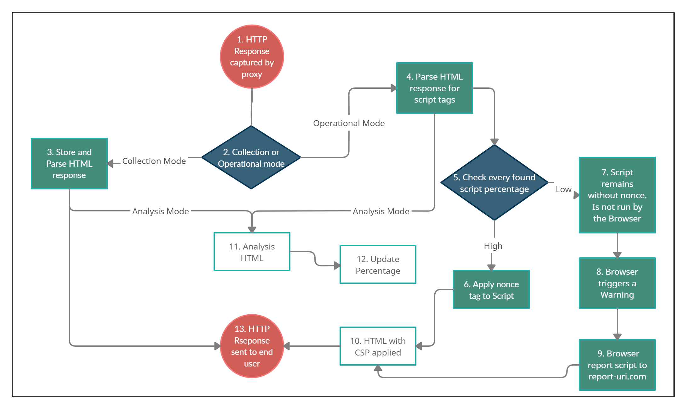
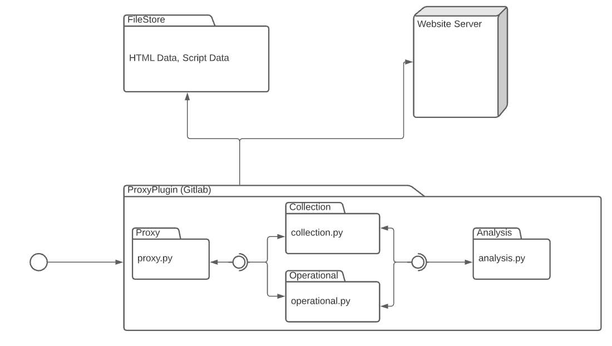
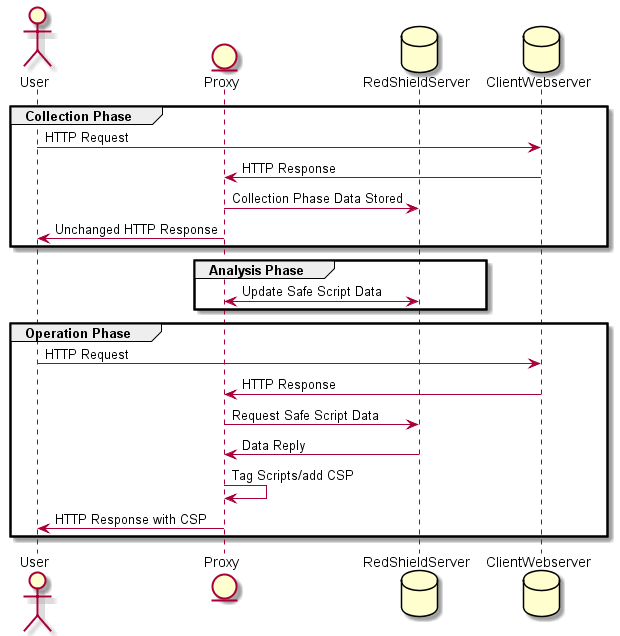
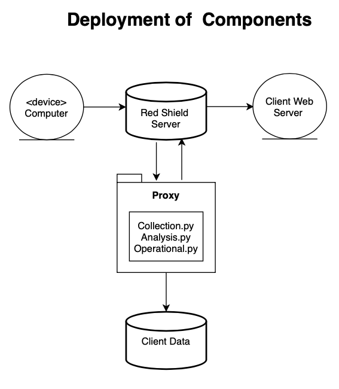
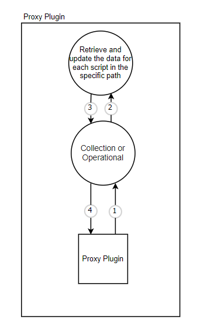
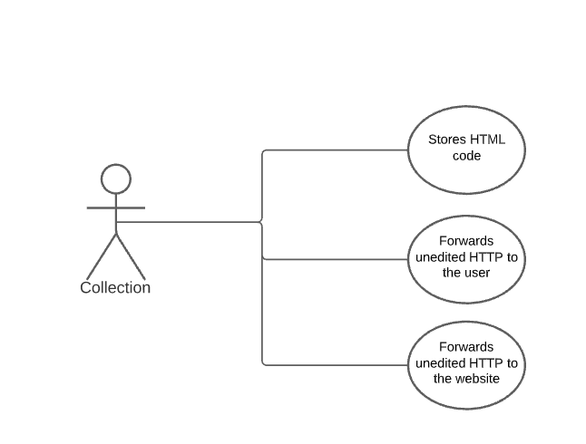
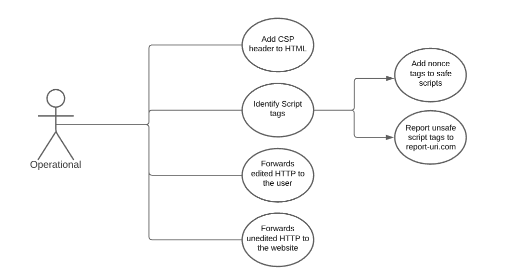
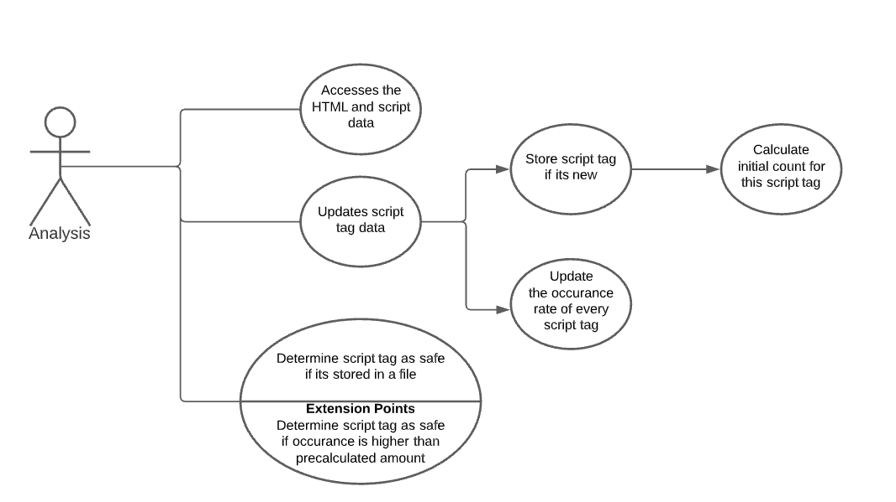

# ENGR 301: Architectural Design and Proof-of-Concept

## Proof-of-Concept

The aim of an architectural proof-of-concept (spike or walking skeleton) is to demonstrate the technical feasibility of your chosen architecture, to mitigate technical and project risks, and to plan and validate your technical and team processes (e.g., build systems, story breakdown, Kanban boards, acceptance testing, deployment).

A walking skeleton is an initial technical attempt that will form the architectural foundation of your product. Since a walking skeleton is expected to be carried into your product, it must be completed to the quality standards expected for your final product. A walking skeleton should demonstrate all the technologies your program will rely on "end-to-end" &mdash; from the user interface down to the hardware.

In the context of ENGR 301, a walking skeleton does not need to deliver any business value to your project: the aim is technical validation and risk mitigation.

## Document

The aim of the architectural design document is to describe the architecture and high-level design of the system your group is to build, to identify any critical technical issues with your design, and to explain how you have addressed the highest rated technical and architectural risks. The architecture document should also demonstrate your understanding of architectural techniques and architectural quality, using tools and associated notations as necessary to communicate the architecture precisely, unambiguously and clearly in a written technical document.

Page specifications below are *limits not targets* and refer to the pages in the PDF generated from the markdown. Because the size of your document is necessarily limited, you should ensure that you focus your efforts on those architectural concerns that are most important to completing a successful system: if sections are at their page limit, indicate how many items would be expected in a complete specification.

The ENGR 301 project architecture design document should be based on the standard ISO/IEC/IEEE 42010:2011(E) _Systems and software engineering &mdash; Architecture description_, plus appropriate sections from ISO/IEC/IEEE 29148:2018(E) _Systems and software engineering &mdash; Life cycle processes &mdash; Requirements engineering_; ISO/IEC/IEEE 15289:2017 _Systems and software engineering &mdash; Content of life-cycle information items (documentation)_; ISO/IEC/IEEE 15288:2015 _Systems and software engineering &mdash; System life-cycle processes_; ISO/IEC/IEEE 12207:2017 _Systems and software engineering &mdash; Software life cycle processes_ and ISO 25010 SQuaRE; with notations from ISO/ISE 19501 (UML). In particular, Annex F of ISO/IEC/IEEE 15288 and Annex F of ISO/IEC/IEEE 12207. These standards are available through the Victoria University Library subscription to the [IEEE Xplore Digital Library](https://ieeexplore.ieee.org/) (e.g., by visiting IEEE Xplore from a computer connected to the University network).

The document should contain the sections listed below, and conform to the formatting rules listed at the end of this brief.

All team members are expected to contribute equally to the document and list their contributions in the last section of the document (please make sure that your continued contribution to this document can be traced in GitLab). You should work on your document in your team's GitLab repository in a directory called "M2_Architecture". If more than one team member has contributed to a particular commit, all those team member IDs should be included in the first line of the git commit message. ``git blame``, ``git diff``, file histories, etc. will be tools used to assess individual contributions, so everyone is encouraged to contribute individually (your contribution should be made to many sections of the document, rather than focusing on just a single section), commit early and commit often.

---

# ENGR 301 Project *14* Architectural Design and Proof-of-Concept

#### Isabella Tomaz Ketley, Jaya Narayan, Timothy McDermott, Dylan Simpson, Damien Tamasese, Nathan Wong, James Houlihan

## 1. Introduction

Web applications are accessed and used by everyone everywhere. Therefore, ensuring web application security is extremely important, yet it is becoming increasingly difficult. There are many vulnerabilities to which web applications are susceptible. The number of potential vulnerabilities makes safeguarding against any exploitation of vulnerabilities very difficult. The exploitation of a single vulnerability may result in an entire website or user account being compromised.   

XSS is one of the most common vulnerabilities which occurs whenever a web application trusts or does not validate untrusted data. [1]. An XSS vulnerability can allow an attacker to execute scripts in an end user’s browser, access a user’s cookies, and could even result in an attacker compromising a user’s account [1]. Furthermore, an XSS attack can have huge consequences, so implementing appropriate security measures is vital.

One way to mitigate the XSS attacks is to use CSP [2]. CSP is an added layer of security that can help protect against different attacks. CSP nonce tags are used to prevent XSS [3]. A nonce is a pseudo-random value intended for one-time use, meaning the nonce changes with each HTTP request [4]. This single-use is to ensure an attacker cannot obtain the value of the nonce. If an application contains script tags in the HTTP response, the nonce value is added as a tag to any trusted script tags within the application. Once the application is run, only script tags with the correct nonce tag and value will be executed [4]. This tagging ensures that only trusted script tags are allowed to be executed within an application. 

This project will use CSP headers and nonce tags to determine whether script tags should be run on a web application to mitigate XSS attacks.   

### Client

Company: RedShield

Contact: Kirk Jackson  
Email: 	kirk@redshield.co  
Address:  
    RedShield  
    Level 12  
    RedShield House  
    79 Boulcott St  

### 1.1 Purpose

The purpose of this project is to create a working prototype of a proxy plugin program. This program will be capable of reading, interpreting, and analyzing HTTP source code, with the intended purpose of preventing XSS from using CSP nonce tags.

### 1.2 Scope

After meeting with the client, Redshield, and having them read the project requirements, some minor changes have been noted. These changes are based more on clarification of functionality rather than changing the required functionality of the project. These changes will have little to no effect on the project moving forward. 

### 1.3 Change to Requirements

The most substantial change is the clarification of the phases of the program’s functionality. Initially, the project team had stated that there were two phases: a collections phase and an operational phase. In the initial report, the collection phase was responsible for collecting HTML responses from the website owners’ server and analysing these responses for script tags.  

This phase has been split into two distinct phases: collection and analysis. The collection phase, in this scenario, is still responsible for the collection and storage of the HTML responses. However, the analysis phase will be responsible for parsing, analysing, and updating the percentages relative to the perceived safety of the script tags within the HTML.  

The operational phase will operate as described in the project requirements documents. This operation being parsing the HTML responses, checking the percentages of found script tags, and applying nonce to those scripts deemed safe.  

This distinction does not change how the proxy plugin operates but rather clarifies collection and analysis. As noted by the client, the ideal outcome of the proxy plugin would be to have all three phases operating simultaneously. Meaning the plugin will continue to update the relative percentages during the operational mode.  

By having these three phases operating as an independent process, the plugin could function in this manner. This does not affect the website user or the website owner, as the plugin will still operate in the same manner. The website user will still have no interaction with the plugin unless entering an invalid script tag. The client will still implement the plugin in the same manner by first initiating the proxy in collection mode, where it will collect HTML responses and analyse said responses to get a baseline percentage of included scripts. Then switching to the operational mode where the program will continue to analyse HTML responses and, in addition, apply nonce to ‘safe’ script tags. Essentially, this distinction allows for greater functionality of the plugin.  

Another change is the program's extension to include a different definition regarding what is considered a ‘safe’ script tag.  

In the initial project requirements, it was stated that:
* For the MVP, any script tag found in the collection phase would be deemed safe.
* For the extended functionality, a script tag having a low occurrence would be deemed as unsafe. 

However, after a discussion with the client, it has been decided that a more optimal way to carry out the extension of the project is to determine whether the occurrence of a script is greater than a precalculated amount. This change will also mean that if an unsafe script tag has been entered into a website during the collection phase, we can account for this and still prevent the script tag from being executed.  

The last change is implementing a ‘whitelist’ of ‘safe’ scripts regardless of context, such as google analytics, as these can be regarded as safe regardless of occurrence. By utilising this approach, the plugin can process HTML responses with more efficiency.  

## 2. References

[1]F. Inc., "CSP Nonce ⟶ Examples and Guide", Content-security-policy.com, 2021. [Online]. Available: https://content-security-policy.com/nonce/. [Accessed: 05- Apr- 2021].

[2]M. West and J. Medley, "Content Security Policy  |  Web Fundamentals  |  Google Developers", Google Developers, 2021. [Online]. Available: https://developers.google.com/web/fundamentals/security/csp/#if_you_absolutely_must_use_it_. [Accessed: 05- Apr- 2021].

[3]J. Keith and J. Sambells, DOM Scripting, 2nd ed. O'Reilly, 2010.

[4]"Products - Content Security Policy", Report URI, 2021. [Online]. Available: https://report-uri.com/products/content_security_policy. [Accessed: 05- Apr- 2021].

[5]S. Larsen, "Csper: Content Security Policy made easy", Csper, 2020. [Online]. Available: https://csper.io/blog/an-introduction-to-report-uri. [Accessed: 05- Apr- 2021].

[6]"mitmproxy - an interactive HTTPS proxy", Mitmproxy.org, 2021. [Online]. Available: https://mitmproxy.org/. [Accessed: 05- Apr- 2021].

[7]V. Pattanshetti, "How the MITM Proxy works", Medium, 2020. [Online]. Available: https://vinodpattanshetti49.medium.com/how-the-mitm-proxy-works-8a329cc53fb. [Accessed: 05- Apr- 2021].

[8]"Content Security Policy - OWASP Cheat Sheet Series", Cheatsheetseries.owasp.org, 2021. [Online]. Available: https://cheatsheetseries.owasp.org/cheatsheets/Content_Security_Policy_Cheat_Sheet.html. [Accessed: 05- Apr- 2021].

[9]D. Hauscknecht, J. Magazinius, A. Sabelfeld, May I? Content Security Policy Endorsement for Browser Extension, Springer Link, 2015

[10]"OWASP Top Ten Web Application Security Risks | OWASP", Owasp.org, 2021. [Online]. Available: https://owasp.org/www-project-top-ten/. [Accessed: 06- Apr- 2021].

[11]"Cross Site Scripting Prevention - OWASP Cheat Sheet Series", Cheatsheetseries.owasp.org, 2021. [Online]. Available: https://cheatsheetseries.owasp.org/cheatsheets/Cross_Site_Scripting_Prevention_Cheat_Sheet.html. [Accessed: 06- Apr- 2021].

[12]"Content Security Policy (CSP) - HTTP | MDN", Developer.mozilla.org, 2021. [Online]. Available: https://developer.mozilla.org/en-US/docs/Web/HTTP/CSP. [Accessed: 06- Apr- 2021].

[13]T. Hunt, "Locking Down Your Website Scripts with CSP, Hashes, Nonces, and Report URI", Troy Hunt, 2017. [Online]. Available: https://www.troyhunt.com/locking-down-your-website-scripts-with-csp-hashes-nonces-and-report-uri/. [Accessed: 06- Apr- 2021].

References to other documents or standards. Follow the IEEE Citation Reference scheme, available from the [IEEE website](https://ieee-dataport.org/sites/default/files/analysis/27/IEEE%20Citation%20Guidelines.pdf) (PDF; 20 KB). (1 page, longer if required)

## 3. Architecture

### 3.1 Stakeholders

Concerns relevant to stakeholders include the portability of the solution Elixir, potential privacy laws and licensing requirements. Less technical requirements are reducing or removing workflow interruptions and preserving ease of use through development. Minimising the attack surface, preserving the confidentiality, integrity, availability of data are also concerns.  Finally, there is the language requirement (Python) and the final delivery of the product to the client. Suitability, feasibility, maintainability and risk factor into each concern.

| Stakeholder                   | Concern                                                                                                                                                                                                                                              | Suitability                                                                                                                                                                                                                                                                                       | Feasibility                                                                                                                                                                                                                                                                           | Risk                                                                                                                                                                                                                                                 | Maintainability                                                                                                                                                                                        |
|-------------------------------|------------------------------------------------------------------------------------------------------------------------------------------------------------------------------------------------------------------------------------------------------|---------------------------------------------------------------------------------------------------------------------------------------------------------------------------------------------------------------------------------------------------------------------------------------------------|---------------------------------------------------------------------------------------------------------------------------------------------------------------------------------------------------------------------------------------------------------------------------------------|------------------------------------------------------------------------------------------------------------------------------------------------------------------------------------------------------------------------------------------------------|--------------------------------------------------------------------------------------------------------------------------------------------------------------------------------------------------------|
| Redshield                     | =                                                                                                                                                                                                                                                    | =                                                                                                                                                                                                                                                                                                 | =                                                                                                                                                                                                                                                                                     | =                                                                                                                                                                                                                                                    | =                                                                                                                                                                                                      |
| - Maintainer                  | -                                                                                                                                                                                                                                                    | -                                                                                                                                                                                                                                                                                                 | -                                                                                                                                                                                                                                                                                     | -                                                                                                                                                                                                                                                    | -                                                                                                                                                                                                      |
|                               | Portability: The program will not be used in the delivered form by Redshield. For their maintenance and ongoing use, the main concern will be the program’s ability to be ported to the Elixir.                                                       | Fair - The program will use loose couplings between methods and follow modular design principles; it should be trivial to replace modules individually and port the system to Elixir. Proper use of documentation and docstrings will further improve the portability.                              | Fair - The implementation will be relatively straightforward; however, managing the security implications of loose coupling may introduce further difficulties.                                                                                                                         | Fair - Low - There is the  potential to introduce an additional attack surface if the coupling methods are not adequately  secured.                                                                                                                    | High - Following established conventions and modular design principles will produce highly maintainable and digestible code.                                                                             |
| - Operator                    | -                                                                                                                                                                                                                                                    | -                                                                                                                                                                                                                                                                                                 | -                                                                                                                                                                                                                                                                                     | -                                                                                                                                                                                                                                                    | -                                                                                                                                                                                                      |
|                               | Privacy/Data Laws: @KIRK Are there any regulations of significance? Will this just be used in NZ? Or do we need to follow GDPR (or Similar)                                                                                                           | -                                                                                                                                                                                                                                                                                                 | -                                                                                                                                                                                                                                                                                     | -                                                                                                                                                                                                                                                    | -                                                                                                                                                                                                      |
| - Owner                       | -                                                                                                                                                                                                                                                    | -                                                                                                                                                                                                                                                                                                 | -                                                                                                                                                                                                                                                                                     | -                                                                                                                                                                                                                                                    | -                                                                                                                                                                                                      |
|                               | Licensing: @KIRK Are we writing this under any specific license?                                                                                                                                                                                      | -                                                                                                                                                                                                                                                                                                 | -                                                                                                                                                                                                                                                                                     | -                                                                                                                                                                                                                                                    | -                                                                                                                                                                                                      |
|                               | Attack Surface: Additional attack surface is a concern as it is counter-productive to the fundamental purpose of the product: Reducing the potential for attacks.                                                                                     | Fair - The vulnerable attack surface as a whole should decrease through the removal of unsafe scripts. Secure coding practices will help minimise the possibility of introducing additional attack vectors.                                                                                         | Low - Fair - Entirely eliminating security vulnerabilities is exceedingly difficult. Following proper practice can help  minimise risk but cannot guarantee the absence of vulnerability.                                                                                               | High - There are significant opportunities to introduce security vulnerabilities and increase the attack surface area.                                                                                                                                 | Fair - The threat landscape is constantly evolving; changes, hotfixes, and patches will almost certainly be required. Maintainability may be difficult because of the requirements for future security.  |
|                               | Data Confidentiality: Confidentiality is essential for the program. Our use of MITMproxy allows for the use of HTTPS without disrupting the application’s ability to function.                                                                        | High - MITMproxy can handle HTTPS connections guaranteeing the same level of confidentiality that would typically be expected for browsing the web.                                                                                                                                                 | Fair - Implementing an unfamiliar product may have issues that were not expected. Python is explicitly supported through their API, which will make integration easier.                                                                                                                 | Low - MITMproxy is open source, widely used and well tested. Security vulnerabilities are likely to be discovered and fixed very quickly.                                                                                                              | High - As MITMproxy is highly prevalent and open source, it is likely to remain supported for the foreseeable future. The codebase is publicly available, improving the ease of maintenance.             |
|                               | Data Integrity: As this project is likely to be used in secure environments, preserving data integrity is crucial - however, to function as needed, the program must add nonce tags.                                                                  | Fair - High - Typically, no changes will need to be made (except the addition of nonce tags) as the collection phase should correctly identify most scripts. In the event of a script being prevented From execution, a warning will appear in the browser. MITMproxy will secure data in transit. | Fair - There are no additional barriers of significance to the implementation, as this is a core function of our program and primarily handled by MITMproxy.                                                                                                                            | Low - MITMproxy & HTTPS will ensure integrity in transit, and script tagging will not compromise data integrity. Without the user’s notice as they will receive a notification in their browser.                                                       | High - Fair - There are no significant barriers to maintainability in the foreseeable future. The program’s dependency on MITMproxy may prove to be a point of failure.                                  |
|                               | Stability/Reliability: Uptime and reliability are both availability concerns for users. For Redshield to ensure availability, the program produced must be stable and able to fail securely (Per “Project Requirements” - 4.5)                        | High The solution produced will ultimately be ported to Elixir, which is highly suitable for critical infrastructure. Fail secure means any issues the program faces will default to a safe state.                                                                                                | High - Redhshield will handle porting to Elixir (See Portability), and implementing fail-secure is not problematic.                                                                                                                                                                     | Low - Fail-secure by nature is low risk as the system will default to protecting the user.                                                                                                                                                             | High - (See Redshield:  Maintainer - Portability)                                                                                                                                                        |
|                               | Function: The program works as intended and accurately tags safe scripts with  nonces while tracking unsafe scripts using  report URI.                                                                                                                | High - N/A - The function is the suitability criteria the product is being built again.                                                                                                                                                                                                           | Fair - Ensuring all criteria are met within the given time frame may be challenging; delivering the minimum viable product should be well within capacity. Accurately classifying scripts is the critical function of the program; doing this from frequency alone may be difficult.   | Fair - High - Non-delivery of the minimum viable product is low risk. False-Negatives put Redshield’s Clients and their end-users at risk and potentially expose them to a hostile entity. False positives impact end-user’s workflow and experience. | High - (See Redshield:  Maintainer - Portability)                                                                                                                                                        |
|                               |                                                                                                                                                                                                                                                      |                                                                                                                                                                                                                                                                                                   |                                                                                                                                                                                                                                                                                       |                                                                                                                                                                                                                                                      |                                                                                                                                                                                                        |
| Users                         | =                                                                                                                                                                                                                                                    | =                                                                                                                                                                                                                                                                                                 | =                                                                                                                                                                                                                                                                                     | =                                                                                                                                                                                                                                                    | =                                                                                                                                                                                                      |
| - Redshield Customers/Clients | -                                                                                                                                                                                                                                                    | -                                                                                                                                                                                                                                                                                                 | -                                                                                                                                                                                                                                                                                     | -                                                                                                                                                                                                                                                    | -                                                                                                                                                                                                      |
|                               | Ease of use: The program should require the absolute minimum interaction from end-users in order to be suitable for a customer. This minimisation serves to both preserve productivity and remove the possibility of user error.                      | High - The end-user will have no exposure to the system, with the exception of occasional browser notifications when a script is prevented from running.                                                                                                                                            | High - The system is designed so that all configuration can be done automatically during the collection phase; No interaction is required from the end-user.                                                                                                                            | Low - Interaction from the user is not required to configure the system, and the exclusion of user interaction introduces no additional risk.                                                                                                          | High - This system is highly maintainable as changes to the system will not affect the end-user’s workflow. Changes to the system can be made without any discernable difference to user experience.     |
|                               | Availability: Consistent (99.99%) uptime is necessary for the product to be viable. Any downtime should be planned - not system failures. Downtime for customers is not acceptable as business-critical or sensitive operations could be interrupted. | High - (See Redshield:  Owner - Stability/Reliability)                                                                                                                                                                                                                                              | High - (See  Redshield:  Owner - Stability/Reliability)                                                                                                                                                                                                                                 | Low -  (See  Redshield:  Owner - Stability/Reliability)                                                                                                                                                                                                 | High - (See  Redshield:  Owner - Stability/Reliability)                                                                                                                                       |
|                               | Confidentiality: Confidentiality must be maintained for clients as sensitive information may pass through the proxy plugin.                                                                                                                           | High - (See Redshield:  Owner - Confidentiality)                                                                                                                                                                                                                                                    | Fair - (See Redshield:  Owner - Confidentiality)                                                                                                                                                                                                                                        | Low - (See Redshield:  Owner - Confidentiality)                                                                                                                                                                                                        | High - (See Redshield:  Owner - Confidentiality)                                                                                                                                                         |
|                               | Integrity: Integrity must be maintained through the program to preserve the authenticity and validity of data and prevent tampering in transit.                                                                                                       | Fair - High - The need to insert nonce-tags makes verifying integrity more complex. (See Redshield:  Owner - Data Integrity)                                                                                                                                                                        | Fair - (See Redshield:  Owner - Data Integrity)                                                                                                                                                                                                                                         | Low - (See Redshield:  Owner - Data Integrity)                                                                                                                                                                                                         | High - Fair (See Redshield:  Owner - Data Integrity)                                                                                                                                                   |
|                               |                                                                                                                                                                                                                                                      |                                                                                                                                                                                                                                                                                                   |                                                                                                                                                                                                                                                                                       |                                                                                                                                                                                                                                                      |                                                                                                                                                                                                        |
| - End Users                   | -                                                                                                                                                                                                                                                    | -                                                                                                                                                                                                                                                                                                 | -                                                                                                                                                                                                                                                                                     | -                                                                                                                                                                                                                                                    | -                                                                                                                                                                                                      |
|                               | Workflow Interruptions: The program should not significantly disrupt workflow as it is both frustrating to the user and reduces individual productivity.                                                                                              | High - The workflow of end-users should be minimally affected - the only noticeable change will be occasional browser warnings when untrusted scripts are blocked from execution.                                                                                                                   | High - (See Redshield Customers/Clients - Ease of use)                                                                                                                                                                                                                                  | Low - (See Redshield Customers/Clients - Ease of use)                                                                                                                                                                                                  | High - (See Redshield Customers/Clients - Ease of use)                                                                                                                                                   |
|                               |                                                                                                                                                                                                                                                      |                                                                                                                                                                                                                                                                                                   |                                                                                                                                                                                                                                                                                       |                                                                                                                                                                                                                                                      |                                                                                                                                                                                                        |
| Group-14                      | =                                                                                                                                                                                                                                                    | =                                                                                                                                                                                                                                                                                                 | =                                                                                                                                                                                                                                                                                     | =                                                                                                                                                                                                                                                    | =                                                                                                                                                                                                      |
| - Suppliers                   | -                                                                                                                                                                                                                                                    | -                                                                                                                                                                                                                                                                                                 | -                                                                                                                                                                                                                                                                                     | -                                                                                                                                                                                                                                                    | -                                                                                                                                                                                                      |
|                               | Distribution: The program will be provided to the client (Redshield) as Python source code and the documentation and any associated files produced in development.                                                                                    | High - The client has requested to receive the program as python source code.                                                                                                                                                                                                                       | High - Fair - (See Redshield:  Owner - Function).                                                                                                                                                                                                                                         | Low - The minimum viable product is within the capacity of the group.                                                                                                                                                                                  | High - The program is to be  provided as requested. (See Redshield:  Maintainer - Portability)                                                                                                           |
|                               |                                                                                                                                                                                                                                                      |                                                                                                                                                                                                                                                                                                   |                                                                                                                                                                                                                                                                                       |                                                                                                                                                                                                                                                      |                                                                                                                                                                                                        |
| - Developers                  | -                                                                                                                                                                                                                                                    | -                                                                                                                                                                                                                                                                                                 | -                                                                                                                                                                                                                                                                                     | -                                                                                                                                                                                                                                                    | -                                                                                                                                                                                                      |
|                               | Language Requirement: (Python) Python is an unfamiliar language to the group; development within it may introduce additional challenges for some.                                                                                                     | Fair - Python has an abundance of libraries developed to support it and integrates with the tool MITMproxy, which will be used within the project, however as an unfamiliar language, there may be some additional issues faced in development.                                                     | High - Fair - Python is a verbose and straightforward language with robust documentation. It is entirely feasible to learn for the development of this project.                                                                                                                           | Fair - Some may face challenges learning the language while under additional strain from other workloads.                                                                                                                                              | High - (See Redshield:  Maintainer - Portability)                                                                                                                                                        |

### 3.2 Architectural Viewpoints

**Logical:** The logical viewpoint involves the functionality that the system provides to the end user. 

**Development:** The development viewpoint illustrates the system from a developers perspective and involves the software mananagement of the project.   

**Process:** The process viewpoint involves the system processes and how they communicate and run. This view addresses the concurrency, distribution, integrator, performance and scalability of the project.

**Physical:** The physical viewpoint involves the topology of software components on the physical layer and the physical connections between these components. 

**Scenarios:** The scenarios viewpoint describes the architecture of the system through use cases. 

**Circuit Architecture:** The circuit architecture viewpoint involves any circuitry involved with the project. Since this is a software project, there will be no circuitry involved.  

**Hardware Architecture:** The hardware architecture viewpoint involves any hardware involved with the project. Since this is a software project, there will be no hardware involved. 

### 4. Architectural Views

### 4.1 Logical
The proxy will be designed and function independently without any interaction or input from the website user. The website owner will also have limited interactions with the proxy. If the project is made open-source, the website owners only interactions with the proxy plugin will be switching between modes. If the program is not made open source, then the client Redshield will be handling this implementation.  

The diagram below shows the logical interactions of the proxy. It shows how each phase: collection, analyse, and operational all act independently from each other, and how they function relative to the end user, depending on what stage the proxy is set too.  

![alternative text](http://www.plantuml.com/plantuml/png/tLPHRzis47xNhpZaAG4g0tijKg61csm5wYMeFVHX6G96EjjSA58ZgQI2qV--CobHPEaEtSCme2wAIlo-Etwy-tZLMsEPjdqhYbemO-1QDhyPrEFR9tmqt69HZCjGbXNSQVLvWDUmOKzeW4bWjULAtajusVDw3nfDBwm1JWZyijdSmKVygqTZYwKI0XqPBiifEMLQesoWbzZGQpE5c4v9WyLjXveTGvZu_g2YO_KJsw7NUYWAe1zAo-tWbnwkICOpeqYF-UEk69S7z_ubNdulQzLokNDxEDpzoZ8ydcts22r5Gwre5zap8GO8SEtFZGQqL-Zgrim4xGj4gmQsGhs0UloJ0ipPgSqyvdWdjQpGxbK3zHxh9mDywsiJS9UV6s1132YTIJcviqjvG_6ReSFpYxXIIrSfmvvnQiBXbE35c7vnh1DAEtCwb3TSuBbGjMltHO1UDBUuKGxrgKxitAg6RuTvxt_StD11MWoK1EkKdbNjhUqMn_9DYHSjcJua3nLCQl6rm-3ifpCegIzC3cVEO-JUPUIJiLDRfUzbucFZqhc8HPNQyBMxL9m4G4GYLbg8Z9SaySegzq_SkgC-KcQAuijybURBUoZ6yR3USnHDT2LkVR7hNckKTaeNu2kjsV216qiRUEhlVu2fDU_iXktCN5U3ifcYtykjele6g6RoIAQb_AR6hOfahQsc8yFHGR-ogF7XOOT1x8rMhRFQn9wtxhk6MLocXoCTcOoEQHFTWtYRB3eNisUo4VZW1hDbktE3OliAwEaLC6krkVYQYR99U1c1PBCHFZu6FF0ImUTvcqAjCp9SBXP9sNEAiwMtYhEZxRKqyEvs1VVoxaXiyWIUxYBJN7xkcpmYjkgLP68mt1nIRwm-h2spsAAqXAJcc3mR6AUwzatVRTtqaFKmUuvB2vQtQAww3fd69ZAttSH0v85T1kLxXVkI-PjQlvp7QaWOLazcOrkBmqTcAK4gFaQWYDMl8oGINpDHzu9PZF5GBlhhiwIDS2qEHuh6rIbgDHSwPsP9O_tn68oT4drT7FnG8o8J3zv__y5W2zDhMabR4WJ4_lx_1fcJaawp7s6OPUUa2xBbkdqWv-8X_ToXRbr_fd2JrYUjJ9Y4MUzoSfY9VlbV3iOu9kJuZX4PcTxPPssL9icNxvXbZynWLT6vwS_ubUpkqnIyPizuv0KmP8v19o_vYYYhaqmI-4bpYwGGjJjLGeFBybjXFwCr48v49neBKRvvKyMAunXtK0VEaNC1ohAimdyN4xj9wS3DlOHdv2-4F0vWzpY7h5I3HNWhgtYYZ9s0wuRRCMdnbXRwLlmD)

As stated above the proxy's three phases all operate independently from each other. The diagram below shows how the proxy operates relative to what phase it is in, and the logical flow of how the proxy will operate depending on certain conditions. NOTE: the red circles are start and end conditions. The blue diamonds are branching decisions. The green boxes are conditionial responses depending on those decisions and the white squares occur regradless of those decisions.  

### 4.2 Development

The above diagram represents the relationships between the systems that our project involves, along with the necessary interfaces.
Most, if not all, the development process is managed entirely by GitLab. GitLab will therefore be the solution to version control as it can log commits allowing for the prevention of loss of work. One of the risks that we identified was the loss of work and data, whether from deletion or overridden. This loss was observed to be prevented by backing up the code on GitLab to be reverted when needed. 

The master branch will always have a functioning version, and separate branches will be created for development. The use branches will ensure that functional code in the master is not overwritten. The separate branches can be merged into master through the use of a merge request. The merge requests functionality can be used to ensure functional code is committed to the master. This branch management provides us with the ability to review all code before merging into the master branch. The approval process requires at least two members to approve the code before merging into the master branch. 

The Issues feature in GitLab allows management of specific parts of the project that need to be completed or have been completed. It allows the team to manage workload and ensures a fair distribution of the workload. Issues can be assigned to team members to prevent overlaps of work. The use of this tool will assist with time management and development progress.

### 4.3 Process
The process viewpoints outline the operations that take place when the system is run on a webserver. It shows how all entities in a HTTP connection interact with the proxy during the different phases of its life-cycle. 

The following sequence model diagram is set up to outline the phase execution order. The user trying to connect to a webpage
with the proxy installed is shown on the left of the diagram along with the other entities of the HTTP connection. The
arrows between the entities and the user show when they interact with each other. A definition that explains what is happening during the interaction is also included.

### 4.4 Physical 

This project is solely software-based. Therefore there are no physical requirements that have to be considered. The only requirement outlined for this project was that there must be access to a computer to run the proxy program. Furthermore, the computer must be able to run Python code of version 3.0 or higher. The physical viewpoint outlines how the software deals with the system's hardware availability, reliability, performance, and scalability. Because the project is entirely software-based, there are no physical concerns to be considered.

It is essential to note that this project is part of a more extensive system that includes hardware components and interactions with hardware components. For this software project, there may be hardware concerns when dealing with the larger system in terms of how the software interacts and incorporates with the hardware. The interaction between functions will occur on local disk storage. During the collection phase, data will be both sent. This is a hardware concern that might be considered when the software interacts with hardware. This is not a direct concern of this software project but it may need to be considered when working with larger systems.

### 4.5 Scenarios

The proxy plug-in program has different scenarios depending on the phase in which the website is in. The diagram below, outlines a broad overview of the proxy program and how it works. 

The two most important scenarios for our MVP are:

* The website can run in the collection phase, with no disruptions to the user, and collect the HTML response of the website.

* The website can run in the operation phase, with no disruptions unless an unsafe script tag has been entered into the site.

Each time the website is accessed in both cases, information about each script tag within the page is stored and updated. The analysis phase will be utilised to do this.

## 5. Development Schedule

### 5.1 Schedule

Dates for key project deliverables:

|  Project Deliverables  | Date     |
| ---------------------- |  ------  |
| Architectural Prototype|   Friday 14th May   This was was the day after the final lab before the Performance Assessment.|
| Application - Basic Implementation |   Monday 16th August   This is the final day of the fisrt half of Trimester 2. To be on track a version of the application produced will be provided, that can do the basic operations outlined in the project requirements document. |
| Documentation - Basic Implementation |  Monday 16th August   This is the final day of the fisrt half of Trimester 2. Documentation describing the operation and setup of the program and it's basic functionality will be provided. 
| Further Releases       |   Friday 8th October   This is the final teaching day of Trimester 2. The project should be mostly finished at this point based on time estimates and constraints.|
| Final Project          |   Saturday 6th November   This is the final day of Trimester 2 End of Year assessment period. This is the last week scheduled for the lab.|

Dates are subject to change as project continues

### 5.2 Budget and Procurement

#### 5.2.1 Budget

| Item     | Amount |
| -------- |  ----- |
| Software |  nil   |
| Hardware |  nil   |
| Travel   |  nil   |

This project does not require a budget as it makes use of open-source programs such as MITM. This can be done using personal computers or the computers available at Victoria University of Wellington. 

The client is local and has indicated they can travel to Victoria University of Wellington for meetings. 

#### 5.2.2 Procurement

As stated in Section 5.2.1, as of writing this document, there is no budget requirements for this project. Therefore, there are no procurement requirements.   

### 5.3 Risks 

| Risks    | Type     |  Likelihood  |  Impact  | Mitigation |
| ---------|  ------  | ------------ | -------- | ---------- |
|Code being deleted |Technical |  Likely | Moderate-Significant (depending on amount/importance of code)| Use Gitlab to ensure code is backed up and restore it|
|Code being overwritten | Technical |  Very Likely | Moderate| Use Mattermost to notify others of commits and if code is overwritten, use Gitlab to ensure it can be restored. |
|Team member unable to contribute for unforeseen reasons |Teamwork |  Possible | Moderate-Significant(depending on project stage)| Keep good documentation of what has been done and what needs to be done so others can pick up tasks without too much hassle. |
|Team member has other commitments which cause them to not be available  |Teamwork |  Very Likely  |Minor| Keep good documentation of what is done and what needs to be done so others can pick up tasks without too much hassle and ensure no one is out of the loop. Ensure the team has good communication so if someone is unavailable the rest of the team knows. |
|Team member has not done their specified work| Teamwork |Possible| Significant | Regularly meet up and contact team members to ensure everyone is on track. Refer back to the team contract to ensure everyone is doing their part and what happens if someone isn't.  |
|COVID Lockdown| Teamwork |Very Likely| Significant | Ensure everyone can connect online and that all work is online. |
|Misunderstanding about the project requirements| Requirements |Likely| Moderate | Ensure constant communication with the client and clear up any uncertainties promptly. |
|Changes to project requirements| Requirements | Possible | Significant | Ensure there is a clear understanding of what is required from the team from the beginning and ensure constant communication with the client. |
|Bugs within code going undetected| Technical |Very Likely| Significant | Create robust tests for the program for different aspects of it to minimize the number of errors that go undetected. |
|Team members burning out| Teamwork |Likely| Significant | Ensure everyone is communicating and all work is evenly divided. |

### 5.4 Health and Safety

**Occupational Overuse**
Occupational overuse is a type of overuse injury that may result in Muscle pains, hot or cold flushes, numbness or a restricted range of movement. Team members will be encouraged to take regular breaks away from their work and personal devices to prevent occupation overuse from occurring. Furthermore, realistic deadlines and workloads will be set to discourage overworking, alongside getting the team to practice good time management to prevent individual overuse as an effort to meet deadlines.
Additionally, team members will have ergonomic workspaces so that any required equipment will be nearby and easily accessible. This will also encompass ensuring desks are at the correct height to encourage correct posture and reduce straining. Correct postures will be promoted and ensured for all team members, and the team will use comfortable chairs, which, if possible, will have back support. This will reduce straining and incorrect postures in a work environment, mitigating occupational overuse and its potential symptoms.
https://www.southerncross.co.nz/group/medical-library/occupational-overuse-syndrome-oos

**Eye Strain**
Eye strain occurs when a person has been staring at a computer for long periods without having any breaks away from technology. Insufficient lighting and screen flickering can also contribute to eye strain. As with the Occupational Overuse, the team will be encouraged to take regular breaks away from their work and personal devices. The team will also be encouraged to work in environments with a sufficient lighting level, for example, not working in the dark with the screen as the only light. The team will also make sure that text displayed in any of the work produced is easily readable to avoid eye strain from reading small text.

**Electrical Saftey**
Since we are dealing with technology, there is the risk of receiving electrical shocks from any appliances used in the process of working on this project. Electrical safety could pose a small risk to the health of team members when they are dealing with electrical appliances such as laptops, desktop computers, monitors, electrical jugs, and the associated cables for these appliances.  As per the AS/NZS 3760 Standard, to minimise the risk of any electrical shocks, the team should be encouraged to only use appliances which have been through the Test and Tag process in the last 12 months.

**Cable Management**
Unmanaged cables are a safety risk as team members or nearby people can get caught on them or trip on them. To manage this risk, all team members will ensure that any cables they use will be kept underneath their desk, mitigating the possibility of someone getting caught on them. Furthermore, all cables which are not being used will be stored away in a cupboard or bag to mitigate further the risk unmanaged cables pose.

**COVID-19 Outbreak or Lockdown**
To manage the safety risk of another Covid-19 outbreak or lockdown, team members will ensure all work is saved online using Gitlab, so access to the University labs is not mandatory. Furthermore, everyone involved in the project will ensure they have a way to contact each other online. Online contact methods will ensure all members of the team can work from home. This will mitigate this safety risk as it ensures that if there was a Covid-19 outbreak or lockdown, members do not need to expose themselves to any additional Covid-19 risks to do this project.

**Natural Disaster**
To manage the safety risk of earthquakes, cyclones, or tsunamis, team members will ensure that they each have an understanding of the fundamental Natural Disaster responses that should be carried out in the event of any of the above mentioned natural disasters so that our team maximises their chances of getting through the disasters without injury. This basic knowledge should include what to do in the initial stage of a natural disaster, where to go, and what to do after a natural disaster has occurred.

**Health and Safety at External Workplaces**
The project does not require any work or testing to be held off-campus. However, there is a possibility that some meetings will be held at RedShield's office. To receive a Health and Safety induction for this external workplace, team members will contact the client to arrange this before any work being done at the clients' office.

**Human or Animal Test Subjects**

This project does not include any human or animal subjects. This is because all testing can and will be done by the team, using different web applications.

#### 5.4.1 Safety Plans

Project does not involve risk of death, serious harm, harm or injury.

## 6. Appendices

### 6.1 Assumptions and dependencies 

Below is a list of assumptions and dependencies for this project: 

* It is assumed that during the collection phase, the websites scanned (HTML being parsed) will be clean.  
* It is assumed that if the scripts are hosted on a different domain, they have not been modified after the original application developer determined that they are safe to include in their application.  
* It is assumed that users of this program will have access to either of the following browsers: Edge, Chrome or Firefox. 
* It is assumed that users have access to a technological device (i.e. computer, cellular phone, tablet). 
* It is assumed that users have internet access to run this program. 
* A dependency is that the browsers used must either be Edge, Chrome or Firefox to gain the full benefits of security from CSP being inforced client-side.  

### 6.2 Acronyms and abbreviations

CSP - Content Security Policy

MITM  - Man In The Middle

DOM - Document Object Model

HTML - Hyper-Text Markup Language

HTTP - Hyper-Text Transfer Protocol

XSS - Cross Site Scripting

## 7. Contributions

An one page statement of contributions, including a list of each member of the group and what they contributed to this document.

| Contributors  | Sections    |
| ------        |  ---------- |
|    Dylan      | 1.1, 5.4, 6, 4.1 proofreading (4.2, 4.3, 4.4)           |
|    Isabella   | 1, 1.1, 1.2, 1.3, 4.2, 4.5, 5.3, 5.4 |
|    Damien     | 1, 1.1, 1.2, 1.3, 4.1, 5.2.1, 5.2.2, proofreading(Whole document)  |
|    James      |  5, 3.2, 4.3, proofreading(Whole document)                         |
|    Jaya       |  4.4, 5.3, 6.1                       |
|    Nathan     |  2, 4.2, 5.1                         |
|    Timothy    |  3.1, proofreading (1, 1.1, 1.2, 1.3, 3.2, 4, 4.1, 4.2, 4.3, 4.4, 4.5, 5.4)        |

---

## Formatting Rules 

 * Write your document using [Markdown](https://gitlab.ecs.vuw.ac.nz/help/user/markdown#gitlab-flavored-markdown-gfm) in your team's GitLab repository.
 * Major sections should be separated by a horizontal rule.

## Assessment 

This document will be weighted at 20% on the architectural proof-of-concept(s), and 80% on the architecture design.

The proof-of-concept will be assessed for coverage (does it demonstrate all the technologies needed to build your project?) and quality (with an emphasis on simplicity, modularity, and modifiability).

The document will be assessed by considering both presentation and content. Group and individual group members will be assessed by identical criteria, the group mark for the finished PDF and the individual mark on the contributions visible through `git blame`, `git diff`, file histories, etc. 

The presentation will be based on how easy it is to read, correct spelling, grammar, punctuation, clear diagrams, and so on.

The content will be assessed according to its clarity, consistency, relevance, critical engagement and a demonstrated understanding of the material in the course. We look for evidence these traits are represented and assess the level of performance against these traits. Inspection of the GitLab Group is the essential form of assessing this document. While being comprehensive and easy to understand, this document must be reasonably concise too. You will be affected negatively by writing a report with too many pages (far more than what has been suggested for each section above).

---
