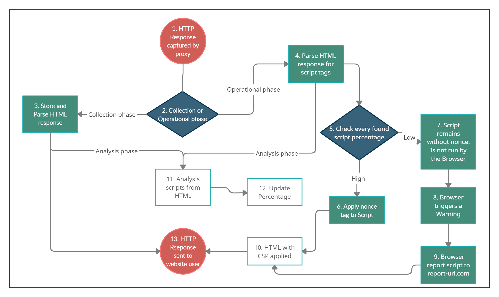
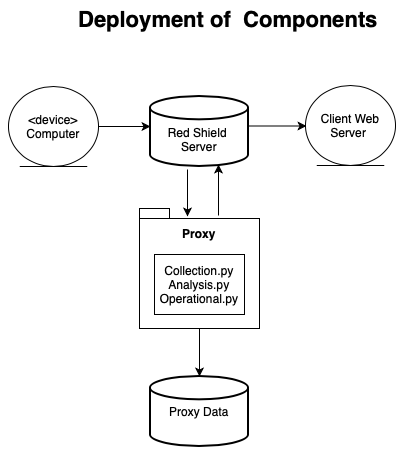
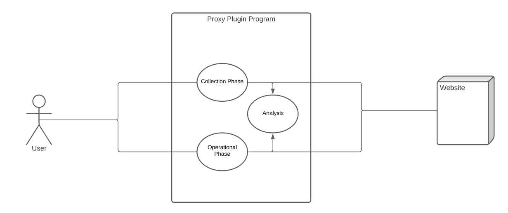

# ENGR 301 Project *14* Architectural Design and Proof-of-Concept

#### Isabella Tomaz Ketley, Jaya Narayan, Timothy McDermott, Dylan Simpson, Damien Tamasese, Nathan Wong, James Houlihan

## 1. Introduction

Web applications are accessed and used by everyone everywhere. Therefore, ensuring web application security is extremely important, yet it is becoming increasingly difficult. There are many vulnerabilities to which web applications are susceptible. The number of potential vulnerabilities makes safeguarding against any exploitation of vulnerabilities very difficult. The exploitation of a single vulnerability may result in an entire website or user account being compromised.   

XSS is one of the most common vulnerabilities which occurs whenever a web application trusts or does not validate untrusted data. [1]. An XSS vulnerability can allow an attacker to execute scripts in an end user’s browser, access a user’s cookies, and could even result in an attacker compromising a user’s account [1]. Furthermore, an XSS attack can have huge consequences, so implementing appropriate security measures is vital.

One way to mitigate the XSS attacks is to use CSP [2]. CSP is an added layer of security that can help protect against different attacks. CSP nonce tags are used to prevent XSS [3]. A nonce is a pseudo-random value intended for one-time use, meaning the nonce changes with each HTTP request [4]. This single-use is to ensure an attacker cannot obtain the value of the nonce. If an application contains script tags in the HTTP response, the nonce value is added as a tag to any trusted script tags within the application. Once the application is run, only script tags with the correct nonce tag and value will be executed [4]. This tagging ensures that only trusted script tags are allowed to be executed within an application. 

This project will use CSP headers and nonce tags to determine whether script tags should be run on a web application to mitigate XSS attacks.   

### Client

Company: RedShield

Contact: Kirk Jackson  
Email: 	kirk@redshield.co  
Address:  
    RedShield  
    Level 12  
    RedShield House  
    79 Boulcott St  

### 1.1 Purpose

The purpose of this project is to create a working prototype of a proxy plugin program. This program will be capable of reading, interpreting, and analyzing HTTP source code, with the intended purpose of preventing XSS from using CSP nonce tags.

### 1.2 Scope

After meeting with the client, Redshield, and having them read the project requirements, some minor changes have been noted. These changes are based more on clarification of functionality rather than changing the required functionality of the project. These changes will have little to no effect on the project moving forward. 

### 1.3 Change to Requirements

The most substantial change is the clarification of the phases of the program’s functionality. Initially, the project team had stated that there were two phases: a collections phase and an operational phase. In the initial report, the collection phase was responsible for collecting HTML responses from the website owners’ server and analysing these responses for script tags.  

This phase has been split into two distinct phases: collection and analysis. The collection phase, in this scenario, is still responsible for the collection and storage of the HTML responses. However, the analysis phase will be responsible for parsing, analysing, and updating the percentages relative to the perceived safety of the script tags within the HTML.  

The operational phase will operate as described in the project requirements documents. This operation being parsing the HTML responses, checking the percentages of found script tags, and applying nonce tags to the scripts deemed as safe.  

This distinction does not change how the proxy plugin operates but rather clarifies collection and analysis. As noted by the client, the ideal outcome of the proxy plugin would be to have all three phases operating simultaneously. Meaning the plugin will continue to update the relative percentages during the operational phase.  

By having these three phases operating as an independent process, the plugin could function in this manner. This does not affect the website user or the website owner, as the plugin will still operate in the same manner. The website user will still have no interaction with the plugin unless entering an invalid script tag. The client will still implement the plugin in the same manner by first initiating the proxy in collection mode, where it will collect HTML responses and analyse said responses to get a baseline percentage of included scripts. Then, the plugin will be switched to the operational mode where the program will continue to analyse HTML responses and, in addition, apply nonce tags to ‘safe’ script tags. Essentially, this distinction allows for greater functionality of the plugin.  

Another change is to the extension of the program to include a different definition regarding what is considered a ‘safe’ script tag.  

In the initial project requirements, it was stated that:
* For the MVP, any script tag found in the collection phase would be deemed safe.
* For the extended functionality, a script tag having a low occurrence would be deemed as unsafe. 

However, after a discussion with the client, it has been decided that a more optimal way to carry out the extension of the project is to determine whether the occurrence of a script is greater than a precalculated amount. This change will also mean that if an unsafe script tag has been entered into a website during the collection phase, we can account for this and still prevent the script tag from being executed.  

The last change is implementing a ‘whitelist’ of ‘safe’ scripts regardless of context, such as google analytics, as these can be regarded as safe regardless of their occurrence. By utilising this approach, the plugin can process HTML responses with more efficiency.  

## 2. References

[1]F. Inc., "CSP Nonce ⟶ Examples and Guide", Content-security-policy.com, 2021. [Online]. Available: https://content-security-policy.com/nonce/. [Accessed: 05- Apr- 2021].

[2]M. West and J. Medley, "Content Security Policy  |  Web Fundamentals  |  Google Developers", Google Developers, 2021. [Online]. Available: https://developers.google.com/web/fundamentals/security/csp/#if_you_absolutely_must_use_it_. [Accessed: 05- Apr- 2021].

[3]J. Keith and J. Sambells, DOM Scripting, 2nd ed. O'Reilly, 2010.

[4]"Products - Content Security Policy", Report URI, 2021. [Online]. Available: https://report-uri.com/products/content_security_policy. [Accessed: 05- Apr- 2021].

[5]S. Larsen, "Csper: Content Security Policy made easy", Csper, 2020. [Online]. Available: https://csper.io/blog/an-introduction-to-report-uri. [Accessed: 05- Apr- 2021].

[6]"mitmproxy - an interactive HTTPS proxy", Mitmproxy.org, 2021. [Online]. Available: https://mitmproxy.org/. [Accessed: 05- Apr- 2021].

[7]V. Pattanshetti, "How the MITM Proxy works", Medium, 2020. [Online]. Available: https://vinodpattanshetti49.medium.com/how-the-mitm-proxy-works-8a329cc53fb. [Accessed: 05- Apr- 2021].

[8]"Content Security Policy - OWASP Cheat Sheet Series", Cheatsheetseries.owasp.org, 2021. [Online]. Available: https://cheatsheetseries.owasp.org/cheatsheets/Content_Security_Policy_Cheat_Sheet.html. [Accessed: 05- Apr- 2021].

[9]D. Hauscknecht, J. Magazinius, A. Sabelfeld, May I? Content Security Policy Endorsement for Browser Extension, Springer Link, 2015

[10]"OWASP Top Ten Web Application Security Risks | OWASP", Owasp.org, 2021. [Online]. Available: https://owasp.org/www-project-top-ten/. [Accessed: 06- Apr- 2021].

[11]"Cross Site Scripting Prevention - OWASP Cheat Sheet Series", Cheatsheetseries.owasp.org, 2021. [Online]. Available: https://cheatsheetseries.owasp.org/cheatsheets/Cross_Site_Scripting_Prevention_Cheat_Sheet.html. [Accessed: 06- Apr- 2021].

[12]"Content Security Policy (CSP) - HTTP | MDN", Developer.mozilla.org, 2021. [Online]. Available: https://developer.mozilla.org/en-US/docs/Web/HTTP/CSP. [Accessed: 06- Apr- 2021].

[13]T. Hunt, "Locking Down Your Website Scripts with CSP, Hashes, Nonces, and Report URI", Troy Hunt, 2017. [Online]. Available: https://www.troyhunt.com/locking-down-your-website-scripts-with-csp-hashes-nonces-and-report-uri/. [Accessed: 06- Apr- 2021].

## 3. Architecture

### 3.1 Stakeholders

Concerns relevant to stakeholders include the portability of the solution to Elixir, potential privacy laws, and licensing requirements. Less technical requirements are reducing or removing workflow interruptions and preserving ease of use through development. Minimising the attack surface, preserving the confidentiality, integrity, availability of data are also concerns.  Finally, there is the language requirement (Python) and the final delivery of the product to the client. Suitability, feasibility, maintainability, and risk factor into each concern.

| Stakeholder                   | Concern                                                                                                                                                                                                                                              | Suitability                                                                                                                                                                                                                                                                                       | Feasibility                                                                                                                                                                                                                                                                           | Risk                                                                                                                                                                                                                                                 | Maintainability                                                                                                                                                                                        |
|-------------------------------|------------------------------------------------------------------------------------------------------------------------------------------------------------------------------------------------------------------------------------------------------|---------------------------------------------------------------------------------------------------------------------------------------------------------------------------------------------------------------------------------------------------------------------------------------------------|---------------------------------------------------------------------------------------------------------------------------------------------------------------------------------------------------------------------------------------------------------------------------------------|------------------------------------------------------------------------------------------------------------------------------------------------------------------------------------------------------------------------------------------------------|--------------------------------------------------------------------------------------------------------------------------------------------------------------------------------------------------------|
| RedShield                     | =                                                                                                                                                                                                                                                    | =                                                                                                                                                                                                                                                                                                 | =                                                                                                                                                                                                                                                                                     | =                                                                                                                                                                                                                                                    | =                                                                                                                                                                                                      |
| - Maintainer                  | -                                                                                                                                                                                                                                                    | -                                                                                                                                                                                                                                                                                                 | -                                                                                                                                                                                                                                                                                     | -                                                                                                                                                                                                                                                    | -                                                                                                                                                                                                      |
|                               | Portability: The program will not be used in the delivered form by RedShield. For their maintenance and ongoing use, the main concern will be the program’s ability to be ported to the Elixir.                                                       | Fair - The program will use loose couplings between methods and follow modular design principles. It should be trivial to replace modules individually and port the system to Elixir. Proper use of documentation and docstrings will further improve the portability.                              | Fair - The implementation will be relatively straightforward; however, managing the security implications of loose coupling may introduce further difficulties.                                                                                                                         | Fair - Low - There is the potential to introduce an additional attack surface if the coupling methods are not adequately secured.                                                                                                                    | High - Following established conventions and modular design principles will produce highly maintainable and digestible code.                                                                             |
| - Operator                    | -                                                                                                                                                                                                                                                    | -                                                                                                                                                                                                                                                                                                 | -                                                                                                                                                                                                                                                                                     | -                                                                                                                                                                                                                                                    | -                                                                                                                                                                                                      |
|                               | Privacy/Data Laws: HTTP requests/responses collected could contain personally identifiable information (PII), or other information of security criticalities such as authentication cookies, passwords, credit card numbers, or 2FA codes.              | Fair/Low -  Compliance with privacy and data retention laws would require the solution to be hosted in a secure environment at RedShield in addition to requiring future work on data sanitization, data retention and other compliance issues.                                                   | -  Low - Implementing processes to meet these standards would require more resources than we have available. After a discussion with the client, it has been decided to remove this from the scope of the project and instead develop a solution for "brochureware" sites that do not require logins." |  High - Improper data handling would put users at risk of PII exposure or potentially compromise their security.                                                                                                      | High - Section to be taken over by RedShield from scratch.                                                                                                                                                                                                      |
| - Owner                       | -                                                                                                                                                                                                                                                    | -                                                                                                                                                                                                                                                                                                 | -                                                                                                                                                                                                                                                                                     | -                                                                                                                                                                                                                                                    | -                                                                                                                                                                                                      |
|                               | Licensing: The client wishes for the project to remain closed source ("Copyright RedShield 2021"). Agreement to be settled near project end.                                                                                                                   | Fair -  Group-14 would like to be able to display the code produced as part of our portfolios, but understand the client's needs regarding commercial sensitivity.                                                                                       | -                                                                                                                                                                                                                                                                                 | -                                                                                                                                                                                                                                                    | -                                                                                                                                                                                                      |
|                               | Attack Surface: Additional attack surface is a concern as it is counter-productive to the fundamental purpose of the product: Reducing the potential for attacks.                                                                                     | Fair - The vulnerable attack surface as a whole should decrease through the removal of unsafe scripts. Secure coding practices will help minimise the possibility of introducing additional attack vectors.                                                                                         | Low - Fair - Entirely eliminating security vulnerabilities is exceedingly difficult. Following proper practice can help minimise risk but cannot guarantee the absence of vulnerabilities.                                                                                               | High - There are significant opportunities to introduce security vulnerabilities and increase the attack surface area.                                                                                                                                 | Fair - The threat landscape is constantly evolving; changes, hotfixes, and patches will almost certainly be required. Maintainability may be difficult because of the requirements for future security.  |
|                               | Data Confidentiality: Confidentiality is essential for the program. Our use of MITM proxy allows for the use of HTTPS without disrupting the application’s ability to function. MITM proxy also requires SSL Certificates for the client machine running it to be able to establish a connection with an origin server.                                                                         | High - MITM proxy can handle HTTPS connections guaranteeing the same level of confidentiality that would typically be expected for browsing the web. The SSL would normally introduce risk to the confidentiality of data, but due to RedShield's architecture, the SSL of customer websites will not be used directly with the proxy.                                                                                                                                                 | Fair - Implementing an unfamiliar product may have issues that were not expected. Python is explicitly supported through their API, which will make integration easier.                                                                                                                 | Low - MITM proxy is open source, widely used and well tested. Security vulnerabilities are likely to be discovered and fixed very quickly.                                                                                                              | High - As MITM proxy is highly prevalent and open source, it is likely to remain supported for the foreseeable future. The codebase is publicly available, improving the ease of maintenance.             |
|                               | Data Integrity: As this project is likely to be used in secure environments, preserving data integrity is crucial. However, to function as needed, the program must add nonce tags and CSP headers.                                                                  | Fair - High - Typically, no changes will need to be made (except for the addition of nonce tags and CSP headers) as the collection phase should correctly identify most scripts. In the event of a script being prevented from execution, a warning will appear in the browser. MITM proxy will secure data in transit. | Fair - There are no additional barriers of significance to the implementation, as this is a core function of our program and primarily handled by MITM proxy.                                                                                                                            | Low - MITM proxy and HTTPS will ensure integrity in transit, and script tagging will not compromise data integrity, without the user’s notice as they will receive a notification in their browser.                                                       | High - Fair - There are no significant barriers to maintainability in the foreseeable future. The program’s dependency on MITM proxy may prove to be a point of failure.                                  |
|                               | Stability/Reliability: Uptime and reliability are both availability concerns for users. For RedShield to ensure availability, the program produced must be stable and able to fail securely (as per “Project Requirements” - 4.5).                        | High - The solution produced will ultimately be ported to Elixir, which is highly suitable for critical infrastructure. Fail-secure means any issues the program faces will default to a safe state.                                                                                                | High - RedShield will handle porting to Elixir (see Portability), and implementing fail-secure is not problematic.                                                                                                                                                                      | Low - Fail-secure by nature is low risk as the system will default to protecting the user.                                                                                                                                                             | High - (see RedShield:  Maintainer - Portability)                                                                                                                                                        |
|                               | Function: The program works as intended and accurately tags safe scripts with nonces tags while tracking unsafe scripts using report-uri.com.                                                                                                                | High - N/A - The function is the suitability criteria the product is being built upon.                                                                                                                                                                                                           | Fair - Ensuring all criteria are met within the given time frame may be challenging; delivering the minimum viable product should be well within capacity. Accurately classifying scripts is the critical function of the program; doing this from frequency alone may be difficult.   | Fair - High - Non-delivery of the minimum viable product is low risk. False-Negatives put RedShield’s Clients and their end-users at risk and potentially expose them to a hostile entity. False positives impact end-users workflow and experience. | High - (see RedShield:  Maintainer - Portability)                                                                                                                                                        |
|                               |                                                                                                                                                                                                                                                      |                                                                                                                                                                                                                                                                                                   |                                                                                                                                                                                                                                                                                       |                                                                                                                                                                                                                                                      |                                                                                                                                                                                                        |
| Users                         | =                                                                                                                                                                                                                                                    | =                                                                                                                                                                                                                                                                                                 | =                                                                                                                                                                                                                                                                                     | =                                                                                                                                                                                                                                                    | =                                                                                                                                                                                                      |
| - RedShield Customers/Clients | -                                                                                                                                                                                                                                                    | -                                                                                                                                                                                                                                                                                                 | -                                                                                                                                                                                                                                                                                     | -                                                                                                                                                                                                                                                    | -                                                                                                                                                                                                      |
|                               | Ease of use: The program should require the absolute minimum interaction from end-users in order to be suitable for a customer. This minimisation serves to both preserve productivity and remove the possibility of user error.                      | High - The end-user will have no exposure to the system, with the exception of occasional browser notifications when a script tag is prevented from being executed.                                                                                                                                            | High - The system is designed so that all configuration can be done automatically during the collection phase; No interaction is required from the end-user.                                                                                                                            | Low - Interaction from the user is not required to configure the system, and the exclusion of user interaction introduces no additional risk.                                                                                                          | High - This system is highly maintainable as changes to the system will not affect the end user’s workflow. Changes to the system can be made without any discernable difference to user experience.     |
|                               | Availability: Consistent (99.99%) uptime is necessary for the product to be viable. Any downtime should be planned, and not system failures. Downtime for customers is not acceptable as business-critical or sensitive operations could be interrupted. | High - (see RedShield:  Owner - Stability/Reliability)                                                                                                                                                                                                                                              | High - (see  RedShield:  Owner - Stability/Reliability) To ensure that the system is reliably available the proxy will be deployed in a scaling group on AWS so that traffic can be handled and routed to nodes which have the ability to take on traffic.                                                                                                                                                                                                                                | Low -  (see  RedShield:  Owner - Stability/Reliability)                                                                                                                                                                                                 | High - (see  RedShield:  Owner - Stability/Reliability)                                                                                                                                       |
|                               | Confidentiality: Confidentiality must be maintained for clients as sensitive information may pass through the proxy plugin.                                                                                                                           | High - (see RedShield:  Owner - Confidentiality)                                                                                                                                                                                                                                                    | Fair - (see RedShield:  Owner - Confidentiality)                                                                                                                                                                                                                                        | Low - (see RedShield:  Owner - Confidentiality)                                                                                                                                                                                                        | High - (see RedShield:  Owner - Confidentiality)                                                                                                                                                         |
|                               | Integrity: Integrity must be maintained through the program to preserve the authenticity and validity of data and prevent tampering in transit.                                                                                                       | Fair - High - The need to insert nonce tags makes verifying integrity more complex. (see RedShield:  Owner - Data Integrity)                                                                                                                                                                        | Fair - (see RedShield:  Owner - Data Integrity)                                                                                                                                                                                                                                         | Low - (see RedShield:  Owner - Data Integrity)                                                                                                                                                                                                         | High - Fair (see RedShield:  Owner - Data Integrity)                                                                                                                                                   |
|                               |                                                                                                                                                                                                                                                      |                                                                                                                                                                                                                                                                                                   |                                                                                                                                                                                                                                                                                       |                                                                                                                                                                                                                                                      |                                                                                                                                                                                                        |
| - End Users                   | -                                                                                                                                                                                                                                                    | -                                                                                                                                                                                                                                                                                                 | -                                                                                                                                                                                                                                                                                     | -                                                                                                                                                                                                                                                    | -                                                                                                                                                                                                      |
|                               | Workflow Interruptions: The program should not significantly disrupt workflow as it is both frustrating to the user and reduces individual productivity.                                                                                              | High - The workflow of end-users should be minimally affected. The only noticeable change will be occasional browser warnings when untrusted scripts are blocked from execution.                                                                                                                   | High - (see RedShield Customers/Clients - Ease of use)                                                                                                                                                                                                                                  | Low - (see RedShield Customers/Clients - Ease of use)                                                                                                                                                                                                  | High - (see RedShield Customers/Clients - Ease of use)                                                                                                                                                   |
|                               |                                                                                                                                                                                                                                                      |                                                                                                                                                                                                                                                                                                   |                                                                                                                                                                                                                                                                                       |                                                                                                                                                                                                                                                      |                                                                                                                                                                                                        |
| Group-14                      | =                                                                                                                                                                                                                                                    | =                                                                                                                                                                                                                                                                                                 | =                                                                                                                                                                                                                                                                                     | =                                                                                                                                                                                                                                                    | =                                                                                                                                                                                                      |
| - Suppliers                   | -                                                                                                                                                                                                                                                    | -                                                                                                                                                                                                                                                                                                 | -                                                                                                                                                                                                                                                                                     | -                                                                                                                                                                                                                                                    | -                                                                                                                                                                                                      |
|                               | Distribution: The program will be provided to the client (RedShield) as Python source code as well as the documentation and any associated files produced in development.                                                                                    | High - The client has requested to receive the program as python source code.                                                                                                                                                                                                                       | High - Fair - (see RedShield:  Owner - Function).                                                                                                                                                                                                                                         | Low - The minimum viable product is within the capacity of the group.                                                                                                                                                                                  | High - The program is to be provided as requested. (see RedShield:  Maintainer - Portability)                                                                                                           |
|                               |                                                                                                                                                                                                                                                      |                                                                                                                                                                                                                                                                                                   |                                                                                                                                                                                                                                                                                       |                                                                                                                                                                                                                                                      |                                                                                                                                                                                                        |
| - Developers                  | -                                                                                                                                                                                                                                                    | -                                                                                                                                                                                                                                                                                                 | -                                                                                                                                                                                                                                                                                     | -                                                                                                                                                                                                                                                    | -                                                                                                                                                                                                      |
|                               | Language Requirement: (Python) Python is an unfamiliar language to the group; development within it may introduce additional challenges for some.                                                                                                     | Fair - Python has an abundance of libraries developed to support it and integrates with the tool MITM proxy, which will be used within the project. However, as Python is an unfamiliar language, there may be some additional issues faced in development.                                                     | High - Fair - Python is a verbose and straightforward language with robust documentation. It is entirely feasible to learn Python for the development of this project.                                                                                                                           | Fair - Some may face challenges learning the language while under additional strain from other workloads.                                                                                                                                              | High - (see RedShield:  Maintainer - Portability)                                                                                                                                                        |

### 3.2 Architectural Viewpoints

**Logical:** The logical viewpoint involves the functionality that the system provides to the end-user. 

**Development:** The development viewpoint illustrates the system from a developer's perspective and involves the software management of the project.   

**Process:** The process viewpoint involves the system processes and how they communicate and run. This view addresses the concurrency, distribution, integrator, performance, and scalability of the project.

**Physical:** The physical viewpoint involves the topology of software components on the physical layer and the physical connections between these components. 

**Scenarios:** The scenario viewpoint describes the architecture of the system through use cases. 

**Circuit Architecture:** The circuit architecture viewpoint involves any circuitry involved with the project. Since this is a software project, there will be no circuitry involved.  

**Hardware Architecture:** The hardware architecture viewpoint involves any hardware involved with the project. Since this is a software project, there will be no hardware involved. 

## 4. Architectural Views

### 4.1 Logical
The proxy will be designed and function independently, without any interaction or input from the website user. The website owner will also have limited interactions with the proxy. If the project is made open-source, the website owners only interactions with the proxy plugin will be switching between phases. If the program is not made open-source, then the client, Redshield, will be handling this implementation.  

The diagram below shows the logical interactions of the proxy. It shows how each phase, collection, analysis, and operational, all act independently from each other, and how they function relative to the end-user, depending on what stage the proxy is set to.  

![Logical Diagram](http://www.plantuml.com/plantuml/png/tLPHRzis47xNhpZaAG4g0tijKg61csm5wYMeFVHX6G96EjjSA58ZgQI2qV--CobHPEaEtSCme2wAIlo-Etwy-tZLMsEPjdqhYbemO-1QDhyPrEFR9tmqt69HZCjGbXNSQVLvWDUmOKzeW4bWjULAtajusVDw3nfDBwm1JWZyijdSmKVygqTZYwKI0XqPBiifEMLQesoWbzZGQpE5c4v9WyLjXveTGvZu_g2YO_KJsw7NUYWAe1zAo-tWbnwkICOpeqYF-UEk69S7z_ubNdulQzLokNDxEDpzoZ8ydcts22r5Gwre5zap8GO8SEtFZGQqL-Zgrim4xGj4gmQsGhs0UloJ0ipPgSqyvdWdjQpGxbK3zHxh9mDywsiJS9UV6s1132YTIJcviqjvG_6ReSFpYxXIIrSfmvvnQiBXbE35c7vnh1DAEtCwb3TSuBbGjMltHO1UDBUuKGxrgKxitAg6RuTvxt_StD11MWoK1EkKdbNjhUqMn_9DYHSjcJua3nLCQl6rm-3ifpCegIzC3cVEO-JUPUIJiLDRfUzbucFZqhc8HPNQyBMxL9m4G4GYLbg8Z9SaySegzq_SkgC-KcQAuijybURBUoZ6yR3USnHDT2LkVR7hNckKTaeNu2kjsV216qiRUEhlVu2fDU_iXktCN5U3ifcYtykjele6g6RoIAQb_AR6hOfahQsc8yFHGR-ogF7XOOT1x8rMhRFQn9wtxhk6MLocXoCTcOoEQHFTWtYRB3eNisUo4VZW1hDbktE3OliAwEaLC6krkVYQYR99U1c1PBCHFZu6FF0ImUTvcqAjCp9SBXP9sNEAiwMtYhEZxRKqyEvs1VVoxaXiyWIUxYBJN7xkcpmYjkgLP68mt1nIRwm-h2spsAAqXAJcc3mR6AUwzatVRTtqaFKmUuvB2vQtQAww3fd69ZAttSH0v85T1kLxXVkI-PjQlvp7QaWOLazcOrkBmqTcAK4gFaQWYDMl8oGINpDHzu9PZF5GBlhhiwIDS2qEHuh6rIbgDHSwPsP9O_tn68oT4drT7FnG8o8J3zv__y5W2zDhMabR4WJ4_lx_1fcJaawp7s6OPUUa2xBbkdqWv-8X_ToXRbr_fd2JrYUjJ9Y4MUzoSfY9VlbV3iOu9kJuZX4PcTxPPssL9icNxvXbZynWLT6vwS_ubUpkqnIyPizuv0KmP8v19o_vYYYhaqmI-4bpYwGGjJjLGeFBybjXFwCr48v49neBKRvvKyMAunXtK0VEaNC1ohAimdyN4xj9wS3DlOHdv2-4F0vWzpY7h5I3HNWhgtYYZ9s0wuRRCMdnbXRwLlmD)

As stated above, the proxy's three phases all operate independently from each other. The diagram below shows how the proxy operates relative to what phase it is in, and the logical flow of how the proxy will operate depending on certain conditions.  
The red circles are start and end conditions. The blue diamonds are branching decisions and the green boxes are conditional responses depending on those decisions. The white squares occur regardless of any decisions.   

Following this logic, using the example of a normal use of the website i.e., no attempted XSS attack, the website user will send a HTTP request through the proxy to the host website. The host website will send a HTTP response back through the proxy.  
 * During the collection phase, the proxy will: capture the HTTP response (1). Then store and parse the HTML response (3). Then send the HTTP response to the website user (13). 
 * During the operational phase, the proxy will: capture the HTTP response (1). Parse the HTML response and check for script tags (4). The proxy will then check all the found script tags and check them against their percentage, determined by the analysis phase (5). The proxy will identify all the script tags as safe (due to their high percentage) and apply nonce tags to all these scripts (6). The HTML will then have the CSP applied (10) and the whole HTTP response will be sent to the website user (13). 
 * During both phases, the analysis phase will run. The proxy will capture the HTTP response (1). Then regardless of collection or operational decision (3 or 4), the proxy will analyse the script tags that were found during the collection or operational phases (11). These scripts will then have their percentages updated (occurrence/per page access) (12). 
 
Using the example of an attempted XSS attack, the website user will send the HTTP request with the XSS embedded in it. The proxy will forward it to the host website. The host website will send the HTTP response. From here: 

 * During the collection phase, the proxy will follow the same path as if it were normal access to the website i.e., 1, 3, 13. 
 * During the operational phase, the proxy will: capture the HTTP response (1). Parse the HTML response and check for script tags (4). The proxy will then check all the found script tags and check them against their percentage determined by the analysis phase. Since there is an unknown or malicious script, the proxy will identify this script as having a low percentage (5). The script will remain in the HTML, but a nonce tag will not be applied to it. Thus, it will not be executed by the browser (7). The browser will trigger a warning (when the HTTP is returned to the website user) (8). The browser will also report the script to report-uri.com (9). All other scripts found (assuming they have a high percentage) will have nonce tags applied to them (6). The HTML, with the unedited malicious script and the edited safe scripts, will have CSP added to it (10) and then be sent to the website user (13).  
 * Similarly to the previous example, the analysis phase will operate during both these phases. It will still analyse the scripts found in the HTML (11) and update their percentages (12). The malicious script will be analysed and have a percentage assigned to it. However, due to its low percentage, the program will still deem it as unsafe due to a low percentage.  

Some further simplified examples of how this diagram shows the process of the program are described below:

Scenario 1:
* A user requests a website that is in the collection phase. The proxy forwards the response from the website to the user and goes through the following stages of the above diagram:  

    **1** -> **2** (the website is in the collection phase) -> **3** -> **11** -> **12** -> **13**

Scenario 2:
* A user requests a website that is in the operational phase. The proxy forwards the response from the website to the user and this response contains a script tag that has never been seen before. The program goes through the following stages of the above diagram:  

    **1** -> **2** (the website is in the operational phase) -> **4** -> **5** (the script tag hasn't been seen before so the percentage is low) -> **7** -> **8** -> **9**-> **10** -> **13**

### 4.2 Development

The diagram above represents the relationship between the ProxyPlugin code that is stored on GitLab, the FileStore, and the Server which contains the website.  

Within the ProxyPlugin the Collection and Operational Python files have a tandem relationship with the proxy. For the proxy to function correctly, both the collection and operational files must provide the correct information. The information gathered by the collection and operational files must be readable such that the proxy can complete its functions on them. Additionally, collection and operational both reply on analysis.  

The FileStore contains the HTML responses and script data that was generated by the analysis of the collection and operational code. Once the HTTP response captured by the ProxyPlugin is processed, it is passed into the FileStore and sent to the end-user.

Most, if not all, of the development process, is managed entirely by GitLab. GitLab will therefore be the solution to version control as it can log commits allowing for the prevention of loss of work. One of the risks that we identified was the loss of work and data, whether from deletion or from being overridden. This loss was observed to be prevented by backing up the code on GitLab to be reverted when needed. 

The master branch will always have a functioning version, and separate branches will be created for development. The use of branches will ensure that the functional code in the master is not overwritten. The separate branches can be merged into master through the use of a merge request. The merge requests functionality can be used to ensure functional code is committed to the master. This branch management provides us with the ability to review all code before merging into the master branch. The approval process requires at least two members to approve the code before merging into the master branch. 

The Issues feature in GitLab allows management of specific parts of the project that need to be completed or have been completed. It allows the team to manage the workload and ensures a fair distribution of the workload. Issues can be assigned to team members to prevent overlaps of work. The use of this tool will assist with time management and development progress.

### 4.3 Process
The process viewpoints outline the operations that take place when the system is run on a webserver. It shows how all entities in an HTTP connection interact with the proxy during the different phases of its life cycle. 

The following sequence model diagram is set up to outline the phase execution order. The user trying to connect to a webpage with the proxy installed is shown on the left of the diagram along with the other entities of the HTTP connection. The arrows between the entities and the user show when they interact with each other. A definition that explains what is happening during the interaction is also included.

### 4.4 Physical 

This project is solely software-based. Therefore there are no physical requirements that have to be considered. The only requirement outlined for this project is that there must be access to a computer to run the proxy program. Furthermore, the computer must be able to run Python code of version 3.0 or higher. The physical viewpoint outlines how the software deals with the system's hardware availability, reliability, performance, and scalability. Because the project is entirely software-based, there are no physical concerns to be considered.

It is essential to note that this project is part of a more extensive system that includes hardware components and interactions with hardware components. For this software project, there may be hardware concerns when dealing with the larger system in terms of how the software interacts and incorporates with the hardware. The interaction between functions will occur on local disk storage. During the collection and analysis phase, data will be both sent and stored. This is a hardware concern that might be considered when the software interacts with hardware. This is not a direct concern of this software project but it may need to be considered when working with larger systems.

### 4.5 Scenarios

The proxy plug-in program has different scenarios depending on the phase in which the website is in. The diagram below outlines a broad overview of the proxy program and how it works. The user sends a HTTP request to the website, which gets intercepted and forwarded to the website by the proxy program. The website then sends a response back to the user, which also gets intercepted by the proxy program.

The two most important scenarios for our MVP are:

* The website can run in the collection phase, with no disruptions to the user, and collect the HTML response of the website. The use cases for the collection phase are shown below.

* The website can run in the operation phase, with no disruptions unless an unsafe script tag has been entered into the site. The use cases for the operational phase are shown below.

Each time the website is accessed in both cases, information about each script tag within the page is stored and updated. The analysis phase will be utilised to do this. The use cases for the analysis phase are shown below.

## 5. Development Schedule

### 5.1 Schedule

Dates for key project deliverables:

|  Project Deliverables  | Date     |
| ---------------------- |  ------  |
| Architectural Prototype|   Friday 14th May   This is the course due date for this document.|
| Collection Phase Implementation|   Tuesday 20th July   This is the end of the first sprint in Trimester 2. Basic implementation of the collection phase will be completed|
| Analysis Phase Implementation |   Tuesday 3rd August   This is the end of the second sprint in Trimester 2. Basic implementation of the analysis phase will be completed|
| Operational Phase Implementation |   Tuesday 17th August   This is the end of the third sprint in Trimester 2. Basic implementation of the operation phase will be completed|
| Application - Minimum Viable Product |   Tuesday 17th August   This is the end of the third sprint in Trimester 2. To be on track, the minimum viable product of the application will be provided. |
| Documentation - Minimum Viable Product |  Friday 13th August   This is the final day of the first half of Trimester 2. Documentation describing the program, the setup of the program and its basic functionality will be provided. 
| Further Releases       |   Friday 8th October   This is the final teaching day of Trimester 2. The project should be mostly finished at this point based on time estimates and constraints.|
| Final Project          |   Saturday 6th November   This is the final day of the Trimester 2 End of Year assessment period. This is the last week scheduled for the lab.|

Dates are subject to change as the project continues

### 5.2 Budget and Procurement

#### 5.2.1 Budget

| Item     | Amount |
| -------- |  ----- |
| Software |  nil   |
| Hardware |  nil   |
| Travel   |  nil   |

This project does not require a budget as it makes use of open-source programs such as MITM. This can be done using personal computers or the computers available at Victoria University of Wellington. 

The client is local and has indicated they can travel to Victoria University of Wellington for meetings. 

#### 5.2.2 Procurement

As stated in Section 5.2.1, as of writing this document, there are no budget requirements for this project. Therefore, there are no procurement requirements.   

### 5.3 Risks 

| Risks    | Type     |  Likelihood  |  Impact  | Mitigation |
| ---------|  ------  | ------------ | -------- | ---------- |
|Code being deleted |Technical |  Likely | Moderate-Significant (depending on amount/importance of code)| Use Gitlab to ensure code is backed up and restore it|
|Code being overwritten | Technical |  Very Likely | Moderate| Use Mattermost to notify others of commits and if code is overwritten, use Gitlab to ensure it can be restored. |
|Team member unable to contribute for unforeseen reasons |Teamwork |  Possible | Moderate-Significant(depending on project stage)| Keep good documentation of what has been done and what needs to be done so others can pick up tasks without too much hassle. |
|Team member has other commitments which cause them to not be available  |Teamwork |  Very Likely  |Minor| Keep good documentation of what is done and what needs to be done so others can pick up tasks without too much hassle and ensure no one is out of the loop. Ensure the team has good communication so if someone is unavailable the rest of the team knows. |
|Team member has not done their specified work| Teamwork |Possible| Significant | Regularly meet up and contact team members to ensure everyone is on track. Refer back to the team contract to ensure everyone is doing their part and what happens if someone isn't.  |
|COVID Lockdown| Teamwork |Very Likely| Significant | Ensure everyone can connect online and that all work is online. |
|Misunderstanding about the project requirements| Requirements |Likely| Moderate | Ensure constant communication with the client and clear up any uncertainties promptly. |
|Changes to project requirements| Requirements | Possible | Significant | Ensure there is a clear understanding of what is required from the team from the beginning and ensure constant communication with the client. |
|Bugs within code going undetected| Technical |Very Likely| Significant | Create robust tests for the program for different aspects of it to minimize the number of errors that go undetected. |
|Team members burning out| Teamwork |Likely| Significant | Ensure everyone is communicating and all work is evenly divided. |

### 5.4 Health and Safety

**Occupational Overuse**
Occupational overuse is a type of overuse injury that may result in Muscle pains, hot or cold flushes, numbness, or a restricted range of movement. Team members will be encouraged to take regular breaks away from their work and personal devices to prevent occupation overuse from occurring. Furthermore, realistic deadlines and workloads will be set to discourage overworking, alongside getting the team to practice good time management to prevent individual overuse as an effort to meet deadlines.
Additionally, team members will have ergonomic workspaces so that any required equipment will be nearby and easily accessible. This will also encompass ensuring desks are at the correct height to encourage correct posture and reduce straining. Correct postures will be promoted and ensured for all team members, and the team will use comfortable chairs, which, if possible, will have back support. This will reduce straining and incorrect postures in a work environment, mitigating occupational overuse and its potential symptoms.
https://www.southerncross.co.nz/group/medical-library/occupational-overuse-syndrome-oos

**Eye Strain**
Eye strain occurs when a person has been staring at a computer for long periods without having any breaks away from technology. Insufficient lighting and screen flickering can also contribute to eye strain. As with the Occupational Overuse, the team will be encouraged to take regular breaks away from their work and personal devices. The team will also be encouraged to work in environments with a sufficient lighting level, for example, not working in the dark with the screen as the only light. The team will also make sure that text displayed in any of the work produced is easily readable to avoid eye strain from reading small text.

**Electrical Safety**
Since we are dealing with technology, there is the risk of receiving electrical shocks from any appliances used in the process of working on this project. Electrical safety could pose a small risk to the health of team members when they are dealing with electrical appliances such as laptops, desktop computers, monitors, electrical jugs, and the associated cables for these appliances.  As per the AS/NZS 3760 Standard, to minimise the risk of any electrical shocks, the team should be encouraged to only use appliances which have been through the Test and Tag process in the last 12 months.

**Cable Management**
Unmanaged cables are a safety risk as team members or nearby people can get caught on them or trip on them. To manage this risk, all team members will ensure that any cables they use will be kept underneath their desk, mitigating the possibility of someone getting caught on them. Furthermore, all cables which are not being used will be stored away in a cupboard or bag to mitigate further the risk unmanaged cables pose.

**COVID-19 Outbreak or Lockdown**
To manage the safety risk of another Covid-19 outbreak or lockdown, team members will ensure all work is saved online using Gitlab, so access to the University labs is not mandatory. Furthermore, everyone involved in the project will ensure they have a way to contact each other online. Online contact methods will ensure all members of the team can work from home. This will mitigate this safety risk as it ensures that if there was a Covid-19 outbreak or lockdown, members do not need to expose themselves to any additional Covid-19 risks to do this project.

**Natural Disaster**
To manage the safety risk of earthquakes, cyclones, or tsunamis, team members will ensure that they each have an understanding of the fundamental Natural Disaster responses that should be carried out in the event of any of the above mentioned natural disasters so that our team maximises their chances of getting through the disasters without injury. This basic knowledge should include what to do in the initial stage of a natural disaster, where to go, and what to do after a natural disaster has occurred.

**Health and Safety at External Workplaces**
The project does not require any work or testing to be held off-campus. However, there is a possibility that some meetings will be held at RedShield's office. To receive a Health and Safety induction for this external workplace, team members will contact the client to arrange this before any work being done at the clients' office.

**Human or Animal Test Subjects**

This project does not include any human or animal subjects. This is because all testing can and will be done by the team, using different web applications.

#### 5.4.1 Safety Plans

The project does not involve risk of death, serious harm, harm or injury.

## 6. Appendices

### 6.1 Assumptions and dependencies 

Below is a list of assumptions and dependencies for this project: 

* It is assumed that during the collection phase, the websites scanned (HTML being parsed) will be clean.  
* It is assumed that if the scripts are hosted on a different domain, they have not been modified after the original application developer determined that they are safe to include in their application.  
* It is assumed that users of this program will have access to either of the following browsers: Edge, Chrome, or Firefox. 
* It is assumed that users have access to a technological device (i.e. computer, cellular phone, tablet). 
* It is assumed that users have internet access to run this program. 
* A dependency is that the browsers used must either be Edge, Chrome, or Firefox to gain the full benefits of security from CSP being inforced client-side.  

### 6.2 Acronyms and abbreviations

CSP - Content Security Policy

MITM  - Man In The Middle

DOM - Document Object Model

HTML - Hyper-Text Markup Language

HTTP - Hyper-Text Transfer Protocol

XSS - Cross-Site Scripting

## 7. Contributions

| Contributors  | Sections    |
| ------        |  ---------- |
|    Dylan      | 1.1, 5.4, 6, 4.1 proofreading (4.2, 4.3, 4.4)           |
|    Isabella   | 1, 1.1, 1.2, 1.3, 4.1, 4.2, 4.5, 5.3, 5.4, 5.4.1, proofreading and grammar (whole document) |
|    Damien     | 1, 1.1, 1.2, 1.3, 4.1, 5.2.1, 5.2.2, proofreading(Whole document)  |
|    James      |  5.1, 3.2, 4.3, proofreading(Whole document)                         |
|    Jaya       |  4.4, 5.3, 6.1  proofreading and grammar(Whole document)           |
|    Nathan     |  2, 4.2, 5.1   proofreading (Section 5)                      |
|    Timothy    |  3.1, proofreading (Whole document)        |

---
